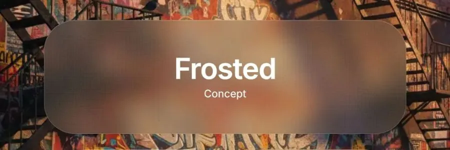
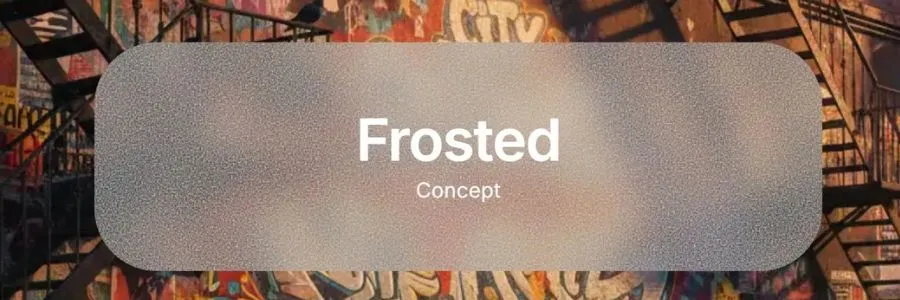
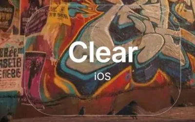
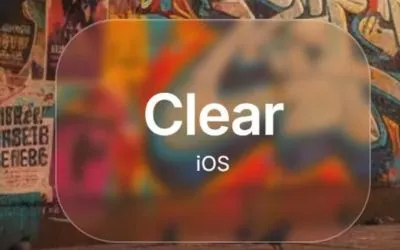

# Glass Morphism Buttons — Frosted, Clear & Blur Effects

A collection of modern glass morphism UI components featuring three distinct effects: Frosted (with texture), Clear (Apple's liquid glass), and Blur (soft background). Perfect for adding depth and elegance to your web projects.


---

## Table of Contents

- [Features](#features)
- [Glass Effects Explained](#glass-effects-explained)
  - [Frosted Effect](#frosted-effect)
  - [Clear Effect (Apple Liquid Glass)](#clear-effect-apple-liquid-glass)
  - [Blur Effect](#blur-effect)
- [Quick Start](#quick-start)
- [Installation](#installation)
- [Usage Examples](#usage-examples)
- [Customization Guide](#customization-guide)
- [Browser Support](#browser-support)
- [Best Practices](#best-practices)
- [Background Image Recommendations](#background-image-recommendations)
- [Performance Tips](#performance-tips)
- [Credits](#credits)
- [License](#license)

---

## Features

| Feature | Description |
|---------|-------------|
| **Three Distinct Effects** | Frosted with grain, Clear with liquid distortion, Blur with soft background |
| **Apple's Liquid Glass** | Uses actual SVG filters from Apple's macOS/iOS UI |
| **Zero Dependencies** | Pure HTML/CSS, no JavaScript required |
| **Fully Responsive** | Adapts to mobile, tablet, and desktop |
| **Customizable** | Easy-to-adjust parameters for all effects |
| **High Performance** | GPU-accelerated, smooth rendering |
| **Modern CSS** | Uses backdrop-filter and CSS filters |
| **Production Ready** | Copy-paste into any project |

---

## Glass Effects Explained

### Frosted Effect

**Concept:** Translucent surface with visible grain/texture, like frosted glass.

**Key Features:**
- Medium blur (20px backdrop-filter)
- Dual-layer noise texture for realism
- Warm color tint
- Subtle shadow for depth

**Best for:** Main call-to-action buttons, headers, hero sections

**CSS Techniques:**
```css
backdrop-filter: blur(20px) saturate(120%) brightness(0.95);
background: rgba(120, 110, 100, 0.25);
```

Here is an example of frosted images from code, modern and coarser one 

 

and 



---

### Clear Effect (Apple Liquid Glass)

**Concept:** Maximum transparency with optical distortion, like looking through clear water.

**Key Features:**
- Apple's actual SVG filter technique
- Liquid-like background distortion
- Minimal blur, maximum see-through
- Same effect as macOS dock

**Best for:** iOS-style interfaces, elegant overlays, navigation bars

## How It Works

The effect uses SVG filters with three main components:

### 1. feTurbulence
Creates fractal noise (random patterns)
```xml
<feTurbulence 
  type="fractalNoise" 
  baseFrequency="0.008 0.008"  ← Controls pattern size
  numOctaves="2"                ← Controls detail levels
  seed="92"                     ← Random seed for pattern
/>
```

### 2. feGaussianBlur
Smooths the noise to make it more natural
```xml
<feGaussianBlur 
  in="noise" 
  stdDeviation="2"  ← Higher = smoother distortion
/>
```

### 3. feDisplacementMap
Warps the image based on the noise pattern
```xml
<feDisplacementMap 
  in="SourceGraphic" 
  in2="blurred"
  scale="70"          ← Distortion strength (0-200)
  xChannelSelector="R"
  yChannelSelector="G"
/>
```

## Parameter Guide

### baseFrequency (How fine/coarse the distortion is)
- **0.004** - Very large, smooth waves
- **0.006** - Subtle, gentle distortion
- **0.008** - Default (Apple's setting) ⭐
- **0.01** - More obvious distortion
- **0.015** - Fine, detailed patterns
- **0.02** - Very fine, almost grainy

💡 **Tip:** Lower = larger patterns, Higher = smaller patterns

### scale (Distortion strength)
- **30-40** - Very subtle
- **50-60** - Gentle
- **70** - Default (Apple's setting) ⭐
- **80-90** - Strong
- **100+** - Very dramatic

💡 **Tip:** This is the most impactful parameter for visibility

### stdDeviation (Blur smoothness)
- **1-1.5** - Sharp, detailed distortion
- **2** - Default (Apple's setting) ⭐
- **3-4** - Softer, smoother
- **5+** - Very smooth, wave-like

### numOctaves (Detail layers)
- **1** - Simple, smooth
- **2** - Default (Apple's setting) ⭐
- **3** - More complex patterns
- **4+** - Very detailed (can be noisy)

## Common Combinations

### Super Subtle (barely visible)
```xml
baseFrequency="0.006"
scale="40"
stdDeviation="2"
numOctaves="1"
```

### Apple Default (recommended)
```xml
baseFrequency="0.008"
scale="70"
stdDeviation="2"
numOctaves="2"
```

### Strong & Obvious
```xml
baseFrequency="0.01"
scale="90"
stdDeviation="2"
numOctaves="2"
```

### Smooth Waves
```xml
baseFrequency="0.005"
scale="100"
stdDeviation="4"
numOctaves="1"
```

## How to Customize

### In your index.html, find the SVG filter:
```html
<filter id="liquid-glass" x="0%" y="0%" width="100%" height="100%">
  <feTurbulence 
    type="fractalNoise" 
    baseFrequency="0.008 0.008"  ← Change these values
    numOctaves="2" 
    seed="92" 
    result="noise" 
  />
  <feGaussianBlur 
    in="noise" 
    stdDeviation="2"  ← Change this
    result="blurred" 
  />
  <feDisplacementMap 
    in="SourceGraphic" 
    in2="blurred" 
    scale="70"  ← Change this
    xChannelSelector="R" 
    yChannelSelector="G" 
  />
</filter>
```

### Change the seed for different patterns
The `seed` value creates different random patterns. Try: 42, 77, 123, 999, etc.

## Browser Performance

✅ **Excellent:** Chrome, Safari, Edge (hardware accelerated)
✅ **Good:** Firefox
⚠️ **Note:** SVG filters can be heavy on very old devices

### Performance Tips:
1. Use lower `numOctaves` (1-2) for better performance
2. Avoid very high `scale` values (keep under 100)
3. Lower `stdDeviation` is faster than higher

## Comparison with Previous Approach

### Before (CSS-only):
- Used backdrop-filter + CSS noise
- Browser-dependent results
- Limited distortion options

### Now (Apple's SVG technique):
- Pure SVG filters
- Consistent across browsers
- Precise control over distortion
- Same as Apple's actual implementation

Here is an example of frosted images from code, modern and coarser one 

 

and 



---

### Blur Effect

**Concept:** Heavy background blur with soft color tint, like Samsung One UI.

**Key Features:**
- Strong blur (10px backdrop-filter)
- Warm background tint
- Soft gradient overlay
- Minimal distortion

**Best for:** Modals, cards, Samsung/Android style interfaces

**CSS Techniques:**
```css
backdrop-filter: blur(10px) saturate(110%);
background: rgba(180, 160, 140, 0.2);
```

---

## Quick Start

### 1. Download Files
```bash
git clone https://github.com/yourusername/glass-morphism-buttons.git
cd glass-morphism-buttons
```

### 2. Open in Browser
```bash
open index.html
```

### 3. Customize
Edit `style.css` to adjust colors, sizes, and blur amounts.

---

## Installation

### Option 1: Download
Download the repository and copy `style.css` and the SVG filter from `index.html`.

### Option 2: Copy Individual Effects

#### Frosted Button
```html
<div class="glass-button frosted">
  <span class="button-title">Frosted</span>
  <span class="button-subtitle">Concept</span>
</div>
```

```css
.frosted {
  background: rgba(120, 110, 100, 0.25);
  backdrop-filter: blur(20px) saturate(120%) brightness(0.95);
  border: 1px solid rgba(255, 255, 255, 0.25);
  /* Add noise texture layers */
}
```

#### Clear Button (Requires SVG filter)
```html
<div class="glass-button clear">
  <div class="clear-filter"></div>
  <div class="clear-overlay"></div>
  <span class="button-title">Clear</span>
  <span class="button-subtitle">iOS</span>
</div>

<svg style="display: none">
  <filter id="liquid-glass" x="0%" y="0%" width="100%" height="100%">
    <feTurbulence type="fractalNoise" baseFrequency="0.008 0.008" 
                  numOctaves="2" seed="92" result="noise" />
    <feGaussianBlur in="noise" stdDeviation="2" result="blurred" />
    <feDisplacementMap in="SourceGraphic" in2="blurred" scale="70" 
                       xChannelSelector="R" yChannelSelector="G" />
  </filter>
</svg>
```

```css
.clear {
  background: transparent;
  border: 1.5px solid rgba(255, 255, 255, 0.3);
}

.clear-filter {
  position: absolute;
  inset: 0;
  filter: url(#liquid-glass);
}
```

#### Blur Button
```html
<div class="glass-button blur">
  <span class="button-title">Blur</span>
  <span class="button-subtitle">One UI</span>
</div>
```

```css
.blur {
  background: rgba(180, 160, 140, 0.2);
  backdrop-filter: blur(10px) saturate(110%);
  border: 1px solid rgba(255, 255, 255, 0.2);
}
```

---

## Usage Examples

### Basic Implementation
```html
<!DOCTYPE html>
<html>
<head>
  <link rel="stylesheet" href="path/to/style.css">
</head>
<body style="background: url('your-image.jpg') center/cover;">
  
  <div class="glass-button frosted">
    <span class="button-title">Click Me</span>
  </div>

  <!-- Include SVG filter for Clear effect -->
  <svg style="display: none">
    <filter id="liquid-glass">...</filter>
  </svg>
</body>
</html>
```

### With Background Image
```css
.background-container {
  background: url("your-image.jpg") no-repeat center center/cover;
  min-height: 100vh;
  display: flex;
  align-items: center;
  justify-content: center;
}
```

### In React/Next.js
```jsx
export default function GlassButton({ effect = "frosted", children }) {
  return (
    <>
      <div className={`glass-button ${effect}`}>
        {effect === "clear" && (
          <>
            <div className="clear-filter"></div>
            <div className="clear-overlay"></div>
          </>
        )}
        <span className="button-title">{children}</span>
      </div>
      
      {effect === "clear" && (
        <svg style={{ display: "none" }}>
          <filter id="liquid-glass">{/* SVG filter code */}</filter>
        </svg>
      )}
    </>
  );
}
```

---

## Customization Guide

### Adjusting Blur Strength

**Frosted:**
```css
backdrop-filter: blur(15px); /* Lighter */
backdrop-filter: blur(25px); /* Stronger */
```

**Clear (SVG scale):**
```xml
<feDisplacementMap scale="50"/>  <!-- Subtle -->
<feDisplacementMap scale="90"/>  <!-- Strong -->
```

**Blur:**
```css
backdrop-filter: blur(5px);  /* Light */
backdrop-filter: blur(20px); /* Heavy */
```

### Changing Colors

**Frosted (warm tones):**
```css
background: rgba(120, 110, 100, 0.25); /* Warm brown */
background: rgba(100, 110, 130, 0.25); /* Cool blue */
```

**Clear (tint):**
```css
.clear-overlay {
  background: rgba(255, 255, 255, 0.02); /* Neutral */
  background: rgba(200, 230, 255, 0.03); /* Blue tint */
}
```

**Blur (colored glass):**
```css
background: rgba(180, 160, 140, 0.2); /* Warm */
background: rgba(140, 160, 180, 0.2); /* Cool */
```

### Adjusting Sizes

```css
.glass-button {
  width: 400px;  /* Adjust width */
  height: 180px; /* Adjust height */
  font-size: 2.5rem; /* Adjust text size */
}
```

### Border Styles

```css
border: 2px solid rgba(255, 255, 255, 0.4); /* Stronger border */
border: none; /* No border */
box-shadow: 0 0 0 1px rgba(255, 255, 255, 0.2); /* Subtle outline */
```

---

## Browser Support

| Browser | Frosted | Clear | Blur |
|---------|---------|-------|------|
| Chrome 76+ | ✅ | ✅ | ✅ |
| Safari 9+ | ✅ | ✅ | ✅ |
| Firefox 103+ | ✅ | ✅ | ✅ |
| Edge 79+ | ✅ | ✅ | ✅ |

### Fallbacks

For older browsers without `backdrop-filter` support:

```css
@supports not (backdrop-filter: blur(10px)) {
  .glass-button {
    background: rgba(255, 255, 255, 0.9); /* Opaque fallback */
  }
}
```

---

## Best Practices

### For Optimal Visual Effect

1. **Use High-Contrast Backgrounds**
   - ✅ Colorful, textured images
   - ✅ Photos with varied details
   - ❌ Solid colors or gradients
   - ❌ Low-contrast minimalist backgrounds

2. **Text Readability**
   - Use white text on darker glass
   - Use dark text on lighter glass
   - Add subtle text shadows if needed

3. **Layering**
   - Place glass elements over busy backgrounds
   - Avoid stacking multiple glass layers (performance)

4. **Performance**
   - Limit number of glass elements (5-10 max)
   - Use `will-change: transform` for animated glass
   - Avoid on low-end mobile devices

---

## Background Image Recommendations

For best results, use backgrounds with:

### ✅ Ideal Characteristics
- **High contrast** — Light and dark areas
- **Multiple colors** — 4+ distinct colors
- **Fine details** — Text, patterns, textures
- **Depth layers** — Foreground and background elements
- **Varied textures** — Wood, fabric, metal, glass

### 🎨 Suggested Themes
- Still life photography (books, flowers, objects)
- Abstract 3D art with gradients
- Urban street art / graffiti
- Nature scenes with foliage
- Colorful interior spaces

### 📸 Where to Find
- [Unsplash](https://unsplash.com/) — Search "colorful still life"
- [Pexels](https://www.pexels.com/) — Search "vibrant abstract"
- Generate with AI: "vibrant still life with books, flowers, vintage objects, colorful fabrics, warm lighting"

---

## Performance Tips

### Optimization Strategies

1. **Reduce Complexity**
   ```css
   /* Lighter blur for better performance */
   backdrop-filter: blur(8px) saturate(120%);
   ```

2. **Hardware Acceleration**
   ```css
   .glass-button {
     transform: translateZ(0); /* Force GPU */
     will-change: transform;
   }
   ```

3. **Limit Animation**
   ```css
   /* Avoid animating backdrop-filter */
   transition: transform 0.3s ease; /* Animate transform instead */
   ```

4. **Mobile Considerations**
   ```css
   @media (max-width: 768px) {
     .glass-button {
       backdrop-filter: blur(5px); /* Reduce blur on mobile */
     }
   }
   ```

---

## Files Included

```
glass-morphism-buttons/
├── index.html                          # Main demo page
├── style.css                           # Complete styles
├── frosted_clear_blur.jpg              # Demo background image
├── apple-liquid-glass-demo.html        # Variations showcase
├── APPLE-LIQUID-GLASS-GUIDE.md        # Detailed SVG filter guide
├── water-effects-demo.html             # Alternative water effects
└── README.md                           # This file
```

---

## Troubleshooting

### Effect Not Visible

**Issue:** Glass effect not showing  
**Solution:** 
- Ensure background has contrast and detail
- Check browser support (need Chrome 76+, Firefox 103+)
- Verify backdrop-filter is not disabled

### Clear Effect Not Distorting

**Issue:** No liquid glass effect  
**Solution:**
- SVG filter must be in the same HTML document
- Check `filter: url(#liquid-glass)` matches filter ID
- Ensure `.clear-filter` div is present

### Performance Issues

**Issue:** Laggy scrolling or animations  
**Solution:**
- Reduce number of glass elements
- Lower blur values
- Remove on mobile devices
- Use simpler backgrounds

---

## Contributing

Contributions are welcome! Feel free to:
- Report bugs
- Suggest improvements
- Submit pull requests
- Share your implementations

---

## Credits

**Developed by:** [ponITech](https://ponitech.pro)  
**Inspired by:** Apple's macOS UI, iOS design system, Samsung One UI

### Special Thanks
- Apple Inc. for the liquid glass SVG filter technique
- UI/UX designers for glass morphism concept
- Web design community for feedback

---

## License

MIT License — Free to use in personal and commercial projects.

```
Copyright (c) 2025 ponITech

Permission is hereby granted, free of charge, to any person obtaining a copy
of this software and associated documentation files (the "Software"), to deal
in the Software without restriction, including without limitation the rights
to use, copy, modify, merge, publish, distribute, sublicense, and/or sell
copies of the Software, and to permit persons to whom the Software is
furnished to do so, subject to the following conditions:

The above copyright notice and this permission notice shall be included in all
copies or substantial portions of the Software.
```

---

## Connect

🌐 **Website:** [ponitech.pro](https://ponitech.pro)  
💼 **LinkedIn:** [Nikola Popović - ponITech](https://www.linkedin.com/in/nikola-popovic-ponitech/)  
🐦 **X/Twitter:** [@ponITech](https://x.com/NikolaP_itech)  
📘 **Facebook:** [ponITech](https://www.facebook.com/profile.php?id=61585398643593)  
💻 **GitHub:** [@yourgithub](https://github.com/NikolaPopovic71)

---

**If you found this useful, give it a ⭐ on GitHub!**

Made with ❤️ in Belgrade, Serbia
